# Apllo Link

- [Apollo Link overview](https://www.apollographql.com/docs/react/api/link/introduction/)

## middleware 構成

## サンプル

~~~ts
import { ApolloLink, Operation, NextLink } from "apollo-link";

export class MyLink extends ApolloLink {
  request(operation: Operation, forward?: NextLink) {
    if (!forward) {
      return null;
    }
    doPreProcess(operation); // MyLinkの中で何かする

    // 次のリンクに操作(operation) を委譲し、結果を受け取る
    response = forward(operation);

    doPostProcess(operation, response)  // 結果の操作を行う

    // 結果を返す
    return response
  }
}
~~~

## 記事

- [Apollo LinkでGraphQLのCustom Directiveを作ろう](https://qiita.com/Quramy/items/b4d42f5b1c52d5cc171d)
