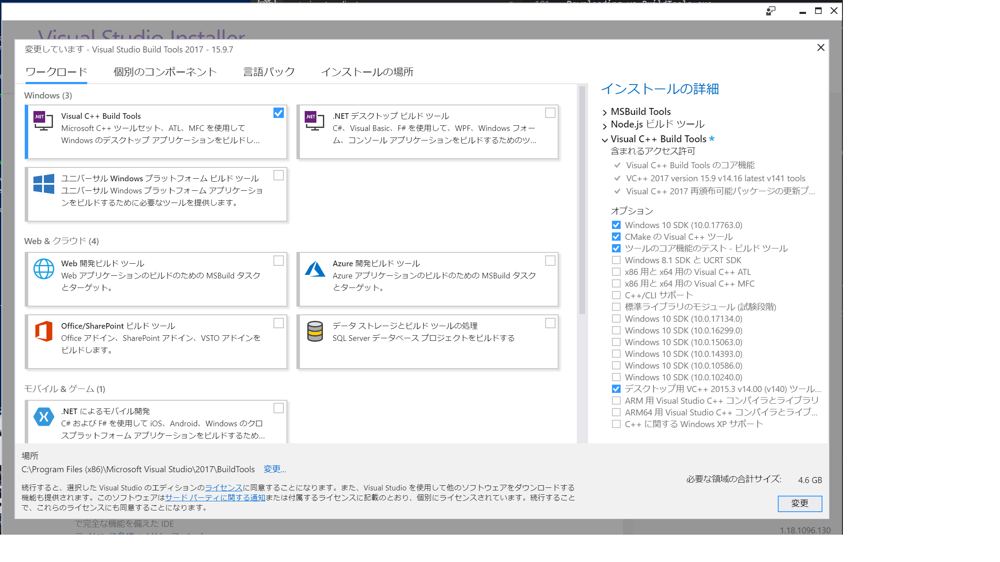

# electron-rebuild

- https://github.com/electron/electron-rebuild

## Windows でリビルドできない

~~~bash
PS C:¥> npx electron-rebuild -f
× Rebuild Failed
...
error MSB8020: v140 (プラットフォーム ツールセット = 'v140') のビルド ツールが見つかりません。
v140 ビルド ツールを使用してビルドするには、v140 ビルド ツールをインストールしてください。
...
~~~

管理コンソールでインストール:

~~~bash
C:¥> npm install --global windows-build-tools

...

Could not install Visual Studio Build Tools.
Please find more details in the log files, which can be found at
C:\Users\spin\.windows-build-tools

Skipping configuration: No configuration for Python or Visual Studio Build Tools required.
TypeError: Cannot read property 'then' of undefined
    at install_1.install (C:\Users\spin\AppData\Roaming\npm\node_modules\windows-build-tools\dist\start.js:19:17)
    at launch_1.launchInstaller.then.then.then (C:\Users\spin\AppData\Roaming\npm\node_modules\windows-build-tools\dist\install\index.js:34:9)
    at process.internalTickCallback (internal/process/next_tick.js:77:7)
+ windows-build-tools@5.1.0
updated 1 package in 3.782s
...
~~~

~~~bash
PS C:\Users\spin\.windows-build-tools> dir

    ディレクトリ: C:\Users\spin\.windows-build-tools

Mode                LastWriteTime         Length Name
----                -------------         ------ ----
d-----       2018/12/28     11:05                python27
-a----       2018/12/28     11:03       20246528 python-2.7.15.amd64.msi
-a----       2018/12/28     11:03        1119848 vs_BuildTools.exe
~~~

### vs_BuildTools を直接実行

- vs_BuildTools.exe を手動起動
- `Windows C++ Build Tools` で `デスクトップ用 VC++ 2015.3 v14.00(v140) ツール` をチェックして更新
- 再度 `npx electron-rebuild -f`  で実行で OK!
